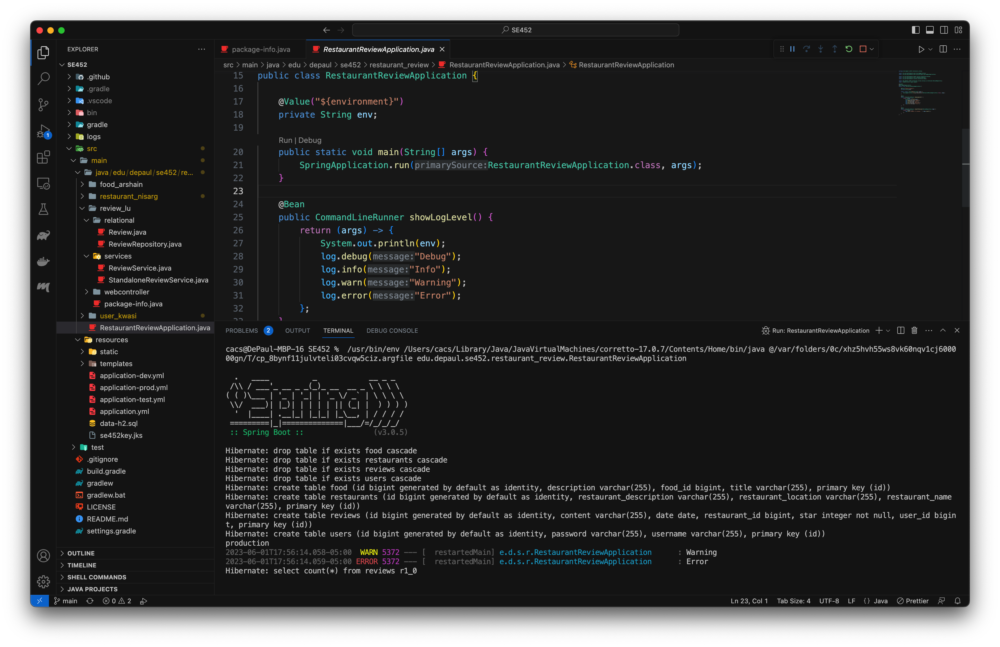

## DePaul SE452 Project

## About the project
This project will be a yelp style website where users can leave reviews on restaurants.

## Key features
| Feature | Description | Developer | Additional Feature Persistence | Additional Feature Non-Persistence
| ----------- | ----------- |------ |------ |------
| Account | visitor can create their account and use it to log in | Kwasi
| Restaurant | store and display all the information of restaurants | Nisarg
| Review | store and display all restaurants's reviews | Lu | Added Additional finders in ReviewRepository | Added Metrics in ReviewService
| History | store food types and connect them to restaurants | Arshain

## Working Code Screenshot
- Final Submission

## Github Location
This will be the Location of the Project https://github.com/luqi-lqi7/SE452

## Conflict Resolve
Each group member has their own feature package, code will be submitted to corresponding package.

## Communication Mechanism
WhatsApp group & Zoom meetings

## Tools
- GitHub
- VSCode
